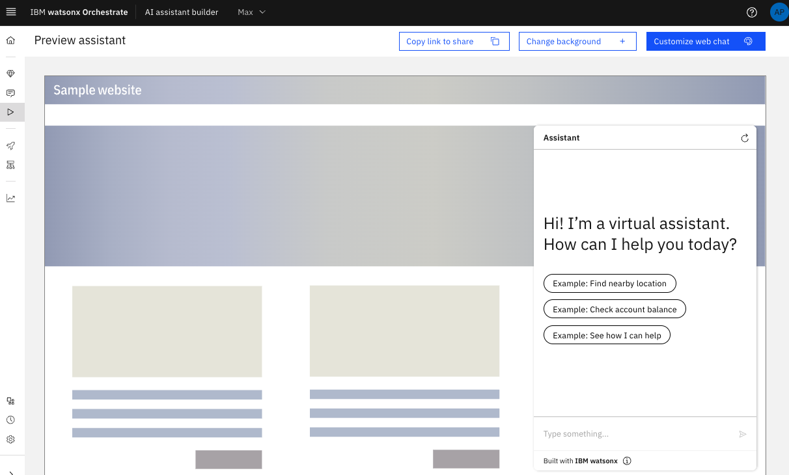
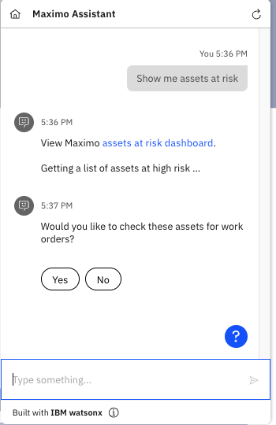

# Watsonx Orchestrate / Maximo Integration 

This codebase demonstrates the creation of a Watsonx Orchestrate skill, which calls Maximo APIs in order to provide a chat assistant in the Maximo Manage/Health UI.

# Prerequisites
- Instance of Watsonx Orchestrate {get version}
- Instance of Maximo 9.0 {correct}
- Cloud account to deploy a Docker Image containing the Watsonx Orchestrate deployed skill.

# Technologies Used

### Python
Python 3.9 is selected for ease of use, readability, performance and speed of implementation for creating a RESTful API.

### FastAPI
FastAPI is a high-performance web framework python library enabling the building of APIs. It is on par with NodeJS and Go performance-wise, fast to code, intuitive and standards based using the open standards for APIS OpenAPI ( https://github.com/OAI/OpenAPI-Specification ) and JSON SCHEMA ( https://json-schema.org/ ).

https://fastapi.tiangolo.com/

# Reference Architecture
You can find reference architecture docs for this assistant and Maximo Applicaiton suite below.

Component Model: https://ibm.github.io/intelligent-asset-reference-architecture/Architecture-Overview/Services-View/Maximo-AI-Assistant-Pattern---Component-Model/

Usage Scenario: https://ibm.github.io/intelligent-asset-reference-architecture/Architecture-Overview/Usage-Scenario/Maximo-AI-Assistant-Pattern---Usage-Scenario/ 


# Deployment & Configuration

1. [Deploy the service](#deploy-the-service)
2. [Acccess the service](#access-the-service)
3. [Configure Watsonx Orchestrate](#configure-watsonx-orchestrate)
4. [Embed the Watsonx Assistant into the Maximo UI](#embed-the-watsonx-assistant-into-the-maximo-ui)


## 1. Deploy the service
In order to deploy the skill you need to deploy this codebase which is a python fastapi service, with a publicly accessible endpoint.  The service implements an OAUTH 2 security scheme using a hard coded user in the codebase itself. The username is 'johndoe', and the password is 'secret'. This can be altered to use whatever user store you wish to use. This is used to authenticate the deployed skill with Watsonx Orchestrate during congiguration.

The running code below shows you how to run the code using docker and command line. If you want to deploy to the cloud to create a publicly accessible endpoint you could use [IBM Code Engine](https://www.ibm.com/products/code-engine) or [NGROK](https://ngrok.com/) locally.


### Build and deploy a Docker image
Install a containerisation tool of choice and install docker.

Clone the code repository. Then, create a new `.env` file in the wxo-maximo-integration folder.

In the `.env` file, set the `MAXIMO_SERVER_ENV` value to your Maximo Manage hostname:
```
MAXIMO_SERVER_ENV={enter your hostname}
```

This repository contains a Dockerfile which you can build an docker image with:
```
docker build -t skill:1.0 .
```
The image can be ran locally using the docker host network
``` 
docker run --rm -d --network host --env-file .env --name skill skill:1.0
```

Acccess the swagger docs for the python service at https://localhost:8000/docs

### Run from code repository
You can run the codebase directly to enable hot reloading of your changes providing a development environment.

1. [Installing Conda](#installing-conda)
2. [Create a Conda Environment](#create-a-conda-environment)
3. [Starting the Service](#starting-the-service)


#### 1. Installing Conda

Follow the getting started steps depending on your OS. 
https://conda.io/projects/conda/en/latest/user-guide/getting-started.html 

#### 2. Create a Conda Environment

Create you conda environment named python39-env where the Python 3.9 runtime will be installed.

`conda create --name python39-env python=3.9`

Show your created conda environment.

`conda env list`  

Activate your conda environment where your command line prompt will now be prefaced with "(python39-env)".  
This indicates you are now in the conda environment that has Python 3.9 installed.

`conda activate python39-env`

Install the requirements in the environment.

`pip install -r requirements.txt`

You can view the packages installed in the Python 3.9 environment.

`conda list -n python39-env`

This ends the setting up of your conda environment.

#### 3. Starting the Service
When you have cloned the code repository, installed and created your conda environment, and activated the environment, 
you can then start the REST API service.

Navigate to the location of the main.py file in the src/app folder.

`cd {project root folder}/src/app`

Run the ASGI web server Uvicorn to start the REST API service.

`uvicorn main:app --reload`

Similar output as below will display as the running server starts up. 

INFO:     Will watch for changes in these directories: ['.../src/app']
INFO:     Uvicorn running on http://127.0.0.1:8000 (Press CTRL+C to quit)
INFO:     Started reloader process [...] using watchgod
INFO:     Started server process [...]
INFO:     Waiting for application startup.
INFO:     Application startup complete.`


## 2. Access the service

#### View REST API Docs
When the web server has started you can view Swagger docs and Redocs

Swagger Link 

`http://127.0.0.1:8000/docs`

Redocs Link

`http://127.0.0.1:8000/redoc`


## 3. Configure Watsonx Orchestrate
The following steps need to be done in order in order to create configure a custom extension and create an assistant.

1. [Edit the OpenAPI specification file](#edit-the-openapi-specification-file)
2. [Create an Assistant](#create-an-assistant)  
3. [Create a custom extension](#create-a-custom-extension)
4. [Upload the actions for the assistant](#4-upload-the-actions-for-the-assistant)
5. [Preview the assistant](#preview-the-assistant)


### 1. Edit the OpenAPI specification file
In this repository there is an openapi.json file, which is an OpenAPI 3.0 specification for the service you deployed. 

The endpoint of the deployed service is used in this file to tell the watsonx custom extension how to call your service with the server url. 

Replace <i>{https endpoint}</i> sections with your endpoint in the sections below.

In the servers section: 

```
"servers": [
    {
        "url": "{https endpoint}"
    }
],
```

In the componenents section:

```
"components": {
    "securitySchemes": {
        "OAuth2PasswordBearer": {
            "type": "oauth2",
            "flows": {
                "password": {
                    "scopes": {},
                    "tokenUrl": "{https endpoint}/token"
                }
            }
        }
    }
}
```


### 2. Create an Assistant

In the AI Assistant builder from the top menu select 'Create New +'


Give your assistant a name for example 'MaximoBot' and a description.


You have now created assistant


### 3. Create a Custom Extension

The first step to create the custom extension is to click on the 'AI Assistant builder' on the Watsonx Orchestrate homepage.

 

When the 'AI Assistant builder' opens hover over the left hand menu and select 'Integrations' on the bottom left.


Scroll down to find the 'Extensions' section and click on the 'Build custom extension' button.


The first step is to name the extension for example 'Maximo Extension'. These names need to be unique for your instance.


Then import the openapi.json file that was previously edited to include your service endpoint and continue to add your extension.

 

The custom extension will then be visible ready for you to add it.


Click the 'Add' button on the extension and follow the steps until you come to 'Authentication'. The sample service has Outh 2 enabled on it, with credentials 'johndoe' and 'secret' which need to be input. A client id and secret are required for this form, but you just need to put something in to validate but they are not used.

 

The credentials you put in are visible here. Your server URL from your `openapi.json` file will be shown at the bottom of the page.


Once this is done you will see the method calls again that are picked up. Select 'Finish'.


The custom extension will be visible now with an 'Open' button if you wish to view the details further. this completes the custom extension setup.


### 4. Upload the actions for the assistant

When in your assistant open up the Global Settings by clicking on the cogwheel in the top right.


Scroll across until you reach the Upload/Download tab.


Select the MaximoBot-actions.json file in this repository and click on Upload. This will give you a popup and select 'Upload and Replace.

 


Once that has been uploaded click on 'Close' in the top right for the settings. You will then see the actions have been uploaded and all of them have green ticks which means that configuration is correct.


### 5. Preview the assistant
At this point you have configured all the required items in Watsonx Orchestrate and the assistant. You can preview the assistant by clicking on 'Preview' on the left hand menu.


The preview of the assistant will be visible in the bottom right. Click on the 'Customizable web chat' button on the top right



Rename your assistant to 'Maximo Assistant' or whatever you choose.


Scroll to the 'Home screen' tab.


Edit the 'Greetings message' and the 'Conversation starters' to show the options available. 


Close the settings and save them. You will now see the customised assistant.


If you try the assistant at this point you will not recieve data back as you need to embed it into your Maximo UI so that the maximo cookie is passed correctly which is expected by the service you deployed. It should look like the below image. 



## 4. Embed the Watsonx Assistant into the Maximo UI

Enabling Maximo Manage to work with Orchestrate requires 2 things
1. Create a System Property that includes the Orchestrate information
2. Create a MYTOKEN script that enables Orchestrate to communicate with Maximo Manage


### Step 1: Create the `mxe.framework.ui.wxo` System Property.

1. In Watson Orchestrate find your `integrationId`, `regionId`, and `serviceId` values and combine them into a single value separated by semi-colons.  eg, `integrationId;regionId;serviceId`
1. Navigate to the System Properties module in Manage
2. Click the "New Row" icon to add a new System Property and enter the following information. (NOTE: `Global Value` is the value you created in the first step)

__Property Name:__ `mxe.framework.ui.wxo`

__Description:__ `Watson Chat Assistant`

__Global Value:__ `integrationId;regionId;serviceId`

__Security Level:__ `SECURE`

__Data Type:__ `ALN`

__Live Refresh:__ `Enabled`


4. Click the "Save" icon
3. Select the newly created property and then click the "Live Refresh" link
3. Click the "OK" button

The `mxe.framework.ui.wxo` System Property is now created with the Orchestrate information.

### Step 2: Create the `MYTOKEN` Automation Script

1. Navigator to the `Automation Scripts` module in Manage
2. Select `Create` then  `Script`
3. Enter `MYTOKEN` as the script name
4. Enter the following Python Script in the script editor box

```python
# responseBody="This worked"

http_request = request.getHttpServletRequest()

# Retrieve cookies from the request
cookies = http_request.getCookies()

if cookies is not None:
    # Iterate through cookies to find the one with the specified name
    for cookie in cookies:
        if "x-access-token" == cookie.getName():
            responseBody = cookie.getValue()
```

5. Click the "Create" button

The `MYTOKEN` script is now created will will allow Orchestrate to access Manage APIs.


